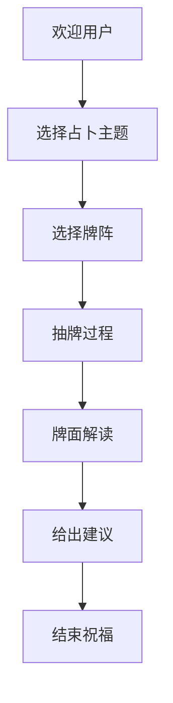

# ✨ 智能塔罗占卜师 | AI Tarot Reading

一个基于AI的全栈塔罗占卜应用，使用MACore框架构建后端，Next.js构建前端。

   

## 🌟 特色功能

- **🔮 智能占卜师**：友好幽默的AI占卜师"星月"，避免过于神秘的表达
- **🎯 多种占卜主题**：爱情、事业、财运、健康、综合运势
- **🎴 多种牌阵**：单张牌、过去-现在-未来三张牌
- **✨ 完整流程**：从欢迎到建议的完整占卜体验
- **🎨 精美界面**：紫色+金色神秘主题
- **📱 响应式设计**：支持桌面和移动端
  
 

## 🚀 快速开始

### 方法一：使用启动脚本（推荐）

```bash
./start.sh
```

### 方法二：手动启动

#### 后端设置

1. 创建虚拟环境：
   ```bash
   python3 -m venv venv
   source venv/bin/activate  # Linux/Mac
   # 或 venv\Scripts\activate  # Windows
   ```

2. 安装依赖：
   ```bash
   pip install -r requirements.txt
   ```

3. 设置环境变量：
   ```bash
   cp env.template .env
   # 编辑 .env 文件，添加你的 API 密钥
   ```

4. 启动后端：
   ```bash
   python main.py
   ```

#### 前端设置

1. 进入前端目录：
   ```bash
   cd frontend
   ```

2. 安装依赖：
   ```bash
   npm install
   ```

3. 启动前端：
   ```bash
   npm run dev
   ```

## 📖 使用说明

1. 访问 http://localhost:3000 打开应用
2. 点击"开始占卜"按钮
3. 选择占卜主题（爱情、事业等）
4. 选择牌阵类型
5. 集中注意力，点击"开始抽牌"
6. 查看抽到的塔罗牌和AI解读
7. 获得积极正面的建议

## 🏗️ 技术架构

### 后端 (Python)
- **框架**: MACore (Agentic AI Framework)
- **API**: FastAPI
- **LLM**: 支持OpenAI、Gemini、DeepSeek
- **设计模式**: Agent + Workflow

### 前端 (TypeScript)
- **框架**: Next.js 15 + React 19
- **样式**: Tailwind CSS 4
- **状态管理**: Zustand + React Query
- **图标**: Lucide React

## 📁 项目结构

```
bgapp_002_easytarot/
├── main.py                  # FastAPI应用入口
├── nodes.py                 # MACore节点定义
├── flow.py                  # 流程定义
├── utils/
│   ├── call_llm.py          # LLM调用
│   ├── tarot_cards.py       # 塔罗牌数据
│   └── card_drawer.py       # 抽牌逻辑
├── frontend/
│   └── src/
│       ├── components/      # React组件
│       ├── hooks/          # 自定义Hooks
│       ├── lib/            # API客户端和工具
│       └── app/            # Next.js页面
├── docs/
│   ├── design.md           # 设计文档
│   └── detail_note.md      # 详细记录
├── requirements.txt        # Python依赖
└── start.sh               # 启动脚本
```

## 🔧 配置

### 环境变量

创建 `.env` 文件并设置：

```bash
# LLM配置
LLM_PROVIDER=openai          # 或 gemini, deepseek
OPENAI_API_KEY=your_key_here
OPENAI_MODEL=gpt-5-mini

# 可选：其他LLM提供商
GEMINI_API_KEY=your_key_here
DEEPSEEK_API_KEY=your_key_here
```

## 🎯 API端点

- `GET /` - API根端点
- `POST /api/v1/divination/start` - 开始占卜
- `POST /api/v1/divination/step` - 处理占卜步骤
- `GET /api/v1/topics` - 获取占卜主题
- `GET /api/v1/spreads` - 获取牌阵类型
- `GET /api/v1/cards/{card_id}` - 获取塔罗牌信息
- `GET /docs` - API文档

## 🎨 设计理念

- **用户友好**: 避免过于神秘或严肃的表达
- **视觉美观**: 紫色主题配金色点缀，避免蓝色系
- **交互流畅**: 完整的占卜流程，每步都有明确引导
- **积极正面**: 所有解读都偏向积极建议

## 🎪 占卜流程



## 🃏 塔罗牌系统

- **22张主要阿卡纳**：从愚者到世界的完整牌组
- **正逆位系统**：每张牌都有正位和逆位的不同含义
- **智能解读**：结合用户选择的主题进行个性化解读
- **积极建议**：基于牌面给出实用的人生建议

## 🤝 贡献

欢迎提交Issue和Pull Request！

## 📄 许可证

本项目采用MIT许可证。

---

✨ **让AI为你解读命运的奥秘，获得人生指引和心灵启发** ✨
